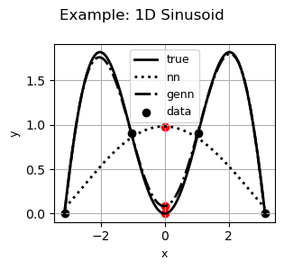
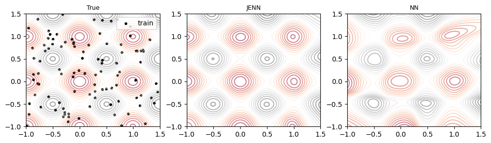
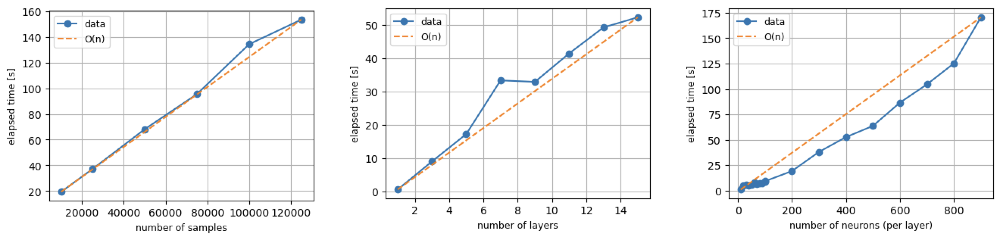

.. jenn documentation master file, created by
   sphinx-quickstart on Sun Jan 21 13:58:31 2024.
   You can adapt this file completely to your liking, but it should at least
   contain the root `toctree` directive.

Welcome to jenn's documentation!
================================

Jacobian-Enhanced Neural Networks (JENN) are fully connected multi-layer
perceptrons, whose training process is modified to predict partial 
derivatives accurately. This is accomplished by minimizing a modified version 
of the Least Squares Estimator (LSE) that accounts for Jacobian prediction error (see theory). 
The main benefit of jacobian-enhancement is better accuracy with
fewer training points compared to standard fully connected neural nets, as illustrated below. 
 

| 

Audience
--------

There exist many excellent deeplearning frameworks, such as `tensorflow <https://www.tensorflow.org/>`_, which 
are more flexible and more performant than `jenn`, as well as many all-purpose ML libraries 
such as `scikit-learn <https://scikit-learn.org/stable/>`_. However, gradient-enhancement is not inherently 
part of them and requires significant effort to be implemented in those tools. The present library is 
intended for those engineers in a rush with a need to predict partials accurately and who are 
seeking a minimal-effort API with a low-barrier to entry. Note that `genn` from the
`smt <https://smt.readthedocs.io/en/latest/_src_docs/surrogate_models/genn.html>`_
project is an older version of `jenn` to be updated. 

Use Case(s)
-----------

JENN is primarily intended for the field of computer aided design, when there is often 
a need to replace computationally expensive, physics-based models with so-called `surrogate models` in
order to save time for further analysis down the line. The field of aerospace engineering is 
rich in examples with two important use-cases that come to mind: 

* Surrgate-based optimization 
* Uncertainty quantification

In both cases, the value proposition is that the computational expense of 
generating the training data to fit a surrogate is much less than the 
computational expense of performing the analysis with the original model itself. 
Since the `surrogate model` emulates the original model accurately 
in real time, it offers a speed benefit that can be used to carry out orders of magnitude 
more function calls quickly, enabling Monte Carlo simulations of computationally expensive functions for example. 

Runtime
-------

The algorithm was verified to scale as :math:`\mathcal{O}(n)`, as shown below. 

| 

Limitations
-----------

Gradient-enhanced methods require responses to be continuous and smooth, 
but they are only beneficial if the cost of obtaining partials 
is not excessive in the first place (e.g. adjoint methods), or if the need for accuracy outweighs the cost of 
computing the partials. Users should therefore carefully weigh the benefit of 
gradient-enhanced methods relative to the needs of their application. 

Acknowledgements
----------------

This code used the exercises by Prof. Andrew Ng in the
`Coursera Deep Learning Specialization <https://www.coursera.org/specializations/deep-learning>`_
as a starting point. It then built upon it to include additional features such
as line search and plotting but, most of all, it fundamentally changed the formulation 
to include gradient-enhancement and made sure all arrays were updated in place (data is never copied). 
The author would like to thank Andrew Ng for
offering the fundamentals of deep learning on Coursera, which took a complicated
subject and explained it in simple terms that even an aerospace engineer could understand.

.. toctree::
    :numbered:
    :caption: Getting Started
    :hidden:

    sections/start

.. toctree::
    :numbered:
    :caption: API Docs
    :hidden:

    sections/api

.. toctree::
    :caption: Appendix
    :hidden:

    sections/appendix