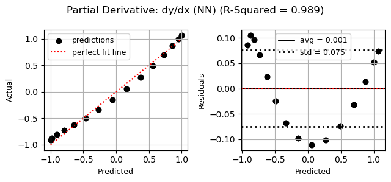
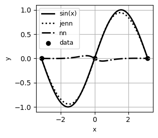

.. _demo notebooks: https://github.com/shb84/JENN/tree/refactor/docs/examples
.. _project repo: https://github.com/shb84/JENN.git

Installation 
------------

The core algorithm is written in Python 3 and requires only `numpy` and `orjson` (for serialization):: 

    pip install jenn 

The `matplotlib` library is used to offer basic plotting utilities, such as checking goodness of fit 
or viewing sensitivity profiles, but it is entirely optional. To install:: 

    pip install jenn[viz]

Data Structures
---------------

In order to use the library effectively, it is essential to understand 
its data structures. Mathematically, JENN is used to predict smooth, continuous functions 
of the form: 
 
.. math::

   \boldsymbol{y} = f(\boldsymbol{x}) 
   \qquad \Rightarrow \qquad 
   \dfrac{\partial \boldsymbol{y}}{\partial \boldsymbol{x}} = f'(\boldsymbol{x}) 

where :math:`\frac{\partial \boldsymbol{y}}{\partial \boldsymbol{x}}` is the Jacobian. 
For a single example, the associated quantities are given by: 

.. math::

   \boldsymbol{x} 
   =
   \left(
   \begin{matrix}
   x_1 \\
   \vdots \\
   x_{n_x}
   \end{matrix}
   \right)
   \in 
   \mathbb{R}^{n_x}
   \quad 
   \boldsymbol{y} 
   =
   \left(
   \begin{matrix}
   y_1 \\
   \vdots \\
   y_{n_y}
   \end{matrix}
   \right)
   \in 
   \mathbb{R}^{n_y}
   \quad
   \frac{\partial \boldsymbol{y}}{\partial \boldsymbol{x}}
   =
   \left(
   \begin{matrix}
   \frac{\partial y_1}{\partial x_1} & \dots & \frac{\partial y_1}{\partial x_{n_x}}  \\
   \vdots & \ddots & \vdots \\
   \frac{\partial y_{n_y}}{\partial x_1} & \dots & \frac{\partial y_{n_y}}{\partial x_{n_x}}  \\
   \end{matrix}
   \right) 
   \in 
   \mathbb{R}^{n_y \times n_x}

For multiple examples, denoted by :math:`m`, these quantities become vectorized as follows: 

.. math::

   \boldsymbol{X} 
   =
   \left(
   \begin{matrix}
   x_1^{(1)} & \dots & x_1^{(m)} \\
   \vdots & \ddots & \vdots \\
   x_{n_x}^{(1)} & \dots & x_{n_x}^{(m)} \\
   \end{matrix}
   \right)
   \in 
   \mathbb{R}^{n_x \times m}
   \qquad 
   \boldsymbol{Y} 
   =
   \left(
   \begin{matrix}
   y_1^{(1)} & \dots & y_1^{(m)} \\
   \vdots & \ddots & \vdots \\
   y_{n_y}^{(1)} & \dots & y_{n_y}^{(m)} \\
   \end{matrix}
   \right)
   \in 
   \mathbb{R}^{n_y \times m}

Similarly, the vectorized version of the Jacobian becomes: 

.. math::
   
   \boldsymbol{J} 
   =
   \left[
   \begin{matrix}
   {\left[
   \begin{matrix}
   \dfrac{\partial y_1}{\partial x_1}^{(1)} & \dots & \dfrac{\partial y_1}{\partial x_{1}}^{(m)}  \\
   \vdots & \ddots & \vdots \\
   \dfrac{\partial y_{1}}{\partial x_{n_x}}^{(1)} & \dots & \dfrac{\partial y_{1}}{\partial x_{n_x}}^{(m)}  \\
   \end{matrix}
   \right]}
   \\ 
   \vdots 
   \\ 
   {\left[
   \begin{matrix}
   \dfrac{\partial y_{n_y}}{\partial x_1}^{(1)} & \dots & \dfrac{\partial y_{n_y}}{\partial x_{1}}^{(m)}  \\
   \vdots & \ddots & \vdots \\
   \dfrac{\partial y_{n_y}}{\partial x_{n_x}}^{(1)} & \dots & \dfrac{\partial y_{n_y}}{\partial x_{n_x}}^{(m)}  \\
   \end{matrix}
   \right]}
   \end{matrix}
   \right]
   \in
   \mathbb{R}^{n_y \times n_x \times m}

Programmatically, these data structures are exclusively represented using shaped `numpy` arrays:: 

    import numpy as np 

    # p = number of inputs 
    # K = number of outputs 
    # m = number of examples in dataset 

    x = np.array(
    [
       [11, 12, 13, 14], 
       [21, 22, 23, 24], 
       [31, 32, 33, 34], 
    ]
    )  # array of shape (n_x, m) = (3, 4)

    y = np.array(
    [
       [11, 12, 13, 14], 
       [21, 22, 23, 24], 
    ]
    )  # array of shape (n_y, m) = (2, 4)

    dydx = np.array(
    [
       [
          [111, 112, 113, 114],
          [121, 122, 123, 124],
          [131, 132, 133, 134],
       ],
       [
          [211, 212, 213, 214],
          [221, 222, 223, 224],
          [231, 232, 233, 234],
       ]
    ]
    )  # array of shape (n_y, n_x, m) = (2, 3, 4)

    p, m = x.shape 
    K, m = y.shape 
    K, p, m = dydx.shape

    assert y.shape[0] == dydx.shape[0]
    assert x.shape[0] == dydx.shape[1]
    assert x.shape[-1] == y.shape[-1] == dydx.shape[-1]

Usage
-----

This section provides a quick example to get started. Consider the task of fitting 
a simple 1D sinusoid using only three data points:: 

    import numpy as np 
    import jenn 

    # Example function to be learned 
    f = lambda x: np.sin(x)  
    f_prime = lambda x: np.cos(x).reshape((1, 1, -1))  # note: jacobian adds a dimension

    # Generate training data 
    x_train = np.linspace(-np.pi , np.pi, 3).reshape((1, -1))
    y_train = f(x_train)
    dydx_train = f_prime(x_train)

    # Generate test data 
    x_test = np.linspace(-np.pi , np.pi, 30).reshape((1, -1))
    y_test = f(x_test)
    dydx_test = f_prime(x_test)

    # Fit jacobian-enhanced neural net
    genn = jenn.model.NeuralNet(
        layer_sizes=[x_train.shape[0], 3, 3, y_train.shape[0]],  # note: user defines hidden layer architecture
        ).fit(
            x_train, y_train, dydx_train, random_state=123  # see docstr for full list of hyperparameters
        )

    # Fit regular neural net (for comparison)
    nn = jenn.model.NeuralNet(
        layer_sizes=[x_train.shape[0], 3, 3, y_train.shape[0]]  # note: user defines hidden layer architecture
        ).fit(
            x_train, y_train, random_state=123  # see docstr for full list of hyperparameters
        )

    # Predict response only 
    y_pred = genn.predict(x_test)

    # Predict partials only 
    dydx_pred = genn.predict_partials(x_train)

    # Predict response and partials in one step 
    y_pred, dydx_pred = genn.evaluate(x_test) 

    # Check how well model generalizes 
    assert jenn.utils.metrics.r_square(y_pred, y_test) > 0.99
    assert jenn.utils.metrics.r_square(dydx_pred, dydx_test) > 0.99

Saving a model for later re-use::

    genn.save("parameters.json")

Reloading the parameters a previously trained model::

    new_model = jenn.model.NeuralNet(layer_sizes=[1, 12, 1]).load('parameters.json')

    y_reloaded, dydx_reloaded = new_model.evaluate(x_test) 

    assert np.allclose(y_reloaded, y_pred)
    assert np.allclose(dydx_reloaded, dydx_pred)

Optional plotting tools are available for convenience, provided `matplotlib` is installed:: 

    from jenn.utils import plot 

    # Example: show goodness of fit of the partials 
    plot.goodness_of_fit(
        y_true=dydx_test[0], 
        y_pred=genn.predict_partials(x_test)[0], 
        title="Partial Derivative: dy/dx (NN)"
    )

::

    # Example: visualize local trends
    plot.sensitivity_profiles(
        f=[f, genn.predict, nn.predict], 
        x_min=x_train.min(), 
        x_max=x_train.max(), 
        x_true=x_train, 
        y_true=y_train, 
        resolution=100, 
        legend=['sin(x)', 'jenn', 'nn'], 
        xlabels=['x'], 
        ylabels=['y'],
        show_cursor=False
    )

Examples 
--------

Elaborated `demo notebooks`_ can be found on the `project repo`_. 

