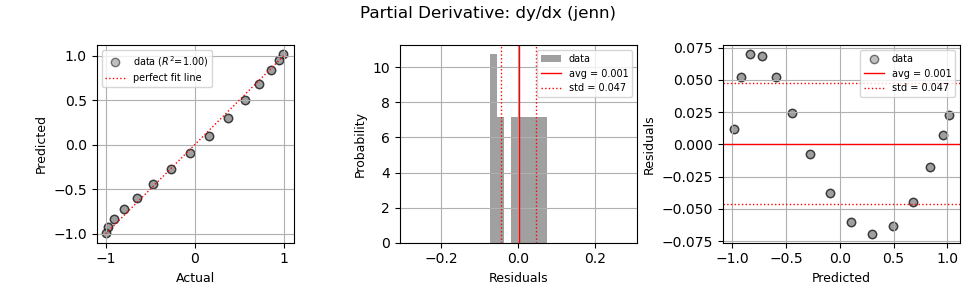
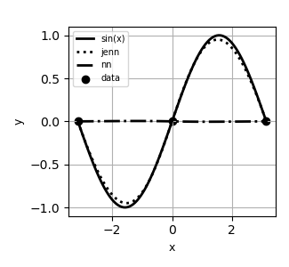

.. _demo notebooks: https://github.com/shb84/JENN/tree/refactor/docs/examples
.. _project repo: https://github.com/shb84/JENN.git
.. _JMP: https://www.jmp.com/en_us/home.html

Installation 
------------

The core algorithm is written in Python 3. It requires `numpy` for computations, `orjson`, `jsonpointer` and `jsonschema` for serialization, and `matplotlib` for visualization:: 

    pip install jenn 

Data Structures
---------------

In order to use the library effectively, it is essential to understand 
its data structures. Mathematically, JENN is used to predict smooth, continuous functions 
of the form: 
 
.. math::

   \boldsymbol{y} = f(\boldsymbol{x}) 
   \qquad \Rightarrow \qquad 
   \dfrac{\partial \boldsymbol{y}}{\partial \boldsymbol{x}} = f'(\boldsymbol{x}) 

where :math:`\frac{\partial \boldsymbol{y}}{\partial \boldsymbol{x}}` is the Jacobian. 
For a single example, the associated quantities are given by: 

.. math::

   \boldsymbol{x} 
   =
   \left(
   \begin{matrix}
   x_1 \\
   \vdots \\
   x_{n_x}
   \end{matrix}
   \right)
   \in 
   \mathbb{R}^{n_x}
   \quad 
   \boldsymbol{y} 
   =
   \left(
   \begin{matrix}
   y_1 \\
   \vdots \\
   y_{n_y}
   \end{matrix}
   \right)
   \in 
   \mathbb{R}^{n_y}
   \quad
   \frac{\partial \boldsymbol{y}}{\partial \boldsymbol{x}}
   =
   \left(
   \begin{matrix}
   \frac{\partial y_1}{\partial x_1} & \dots & \frac{\partial y_1}{\partial x_{n_x}}  \\
   \vdots & \ddots & \vdots \\
   \frac{\partial y_{n_y}}{\partial x_1} & \dots & \frac{\partial y_{n_y}}{\partial x_{n_x}}  \\
   \end{matrix}
   \right) 
   \in 
   \mathbb{R}^{n_y \times n_x}

For multiple examples, denoted by :math:`m`, these quantities become vectorized as follows: 

.. math::

   \boldsymbol{X} 
   =
   \left(
   \begin{matrix}
   x_1^{(1)} & \dots & x_1^{(m)} \\
   \vdots & \ddots & \vdots \\
   x_{n_x}^{(1)} & \dots & x_{n_x}^{(m)} \\
   \end{matrix}
   \right)
   \in 
   \mathbb{R}^{n_x \times m}
   \qquad 
   \boldsymbol{Y} 
   =
   \left(
   \begin{matrix}
   y_1^{(1)} & \dots & y_1^{(m)} \\
   \vdots & \ddots & \vdots \\
   y_{n_y}^{(1)} & \dots & y_{n_y}^{(m)} \\
   \end{matrix}
   \right)
   \in 
   \mathbb{R}^{n_y \times m}

Similarly, the vectorized version of the Jacobian becomes: 

.. math::
   
   \boldsymbol{J} 
   =
   \left[
   \begin{matrix}
   {\left[
   \begin{matrix}
   \dfrac{\partial y_1}{\partial x_1}^{(1)} & \dots & \dfrac{\partial y_1}{\partial x_{1}}^{(m)}  \\
   \vdots & \ddots & \vdots \\
   \dfrac{\partial y_{1}}{\partial x_{n_x}}^{(1)} & \dots & \dfrac{\partial y_{1}}{\partial x_{n_x}}^{(m)}  \\
   \end{matrix}
   \right]}
   \\ 
   \vdots 
   \\ 
   {\left[
   \begin{matrix}
   \dfrac{\partial y_{n_y}}{\partial x_1}^{(1)} & \dots & \dfrac{\partial y_{n_y}}{\partial x_{1}}^{(m)}  \\
   \vdots & \ddots & \vdots \\
   \dfrac{\partial y_{n_y}}{\partial x_{n_x}}^{(1)} & \dots & \dfrac{\partial y_{n_y}}{\partial x_{n_x}}^{(m)}  \\
   \end{matrix}
   \right]}
   \end{matrix}
   \right]
   \in
   \mathbb{R}^{n_y \times n_x \times m}

Programmatically, these data structures are exclusively represented using shaped `numpy` arrays:: 

    import numpy as np 

    # p = number of inputs 
    # K = number of outputs 
    # m = number of examples in dataset 

    x = np.array(
    [
       [11, 12, 13, 14], 
       [21, 22, 23, 24], 
       [31, 32, 33, 34], 
    ]
    )  # array of shape (n_x, m) = (3, 4)

    y = np.array(
    [
       [11, 12, 13, 14], 
       [21, 22, 23, 24], 
    ]
    )  # array of shape (n_y, m) = (2, 4)

    dydx = np.array(
    [
       [
          [111, 112, 113, 114],
          [121, 122, 123, 124],
          [131, 132, 133, 134],
       ],
       [
          [211, 212, 213, 214],
          [221, 222, 223, 224],
          [231, 232, 233, 234],
       ]
    ]
    )  # array of shape (n_y, n_x, m) = (2, 3, 4)

    p, m = x.shape 
    K, m = y.shape 
    K, p, m = dydx.shape

    assert y.shape[0] == dydx.shape[0]
    assert x.shape[0] == dydx.shape[1]
    assert x.shape[-1] == y.shape[-1] == dydx.shape[-1]

Usage
-----

This section provides a quick example to get started. Consider the task of fitting 
a simple 1D sinusoid using only three data points:: 

    import numpy as np
    import jenn

    #########################
    # Example Test Function # 
    #########################

    def f(x): 
        """Compute response."""
        return np.sin(x)
        
        
    def f_prime(x): 
        """Compute partials."""
        return np.cos(x).reshape((1, 1, -1))  # note: jacobian adds a dimension

    ##########################
    # Generate Training Data #
    ##########################

    x_train = np.linspace(-np.pi , np.pi, 3).reshape((1, -1))
    y_train = f(x_train)
    dydx_train = f_prime(x_train)

    ######################
    # Generate Test Data #
    ######################

    x_test = np.linspace(-np.pi , np.pi, 30).reshape((1, -1))
    y_test = f(x_test)
    dydx_test = f_prime(x_test)

    ##################
    # Fit Regular NN # 
    ##################

    regular_model = jenn.NeuralNet(
        layer_sizes=[x_train.shape[0], 3, 3, y_train.shape[0]]  # note: user defines hidden layer architecture
        ).fit(
            x_train, y_train, random_state=123  # see docstr for full list of hyperparameters
        )

    ############
    # Fit JENN # 
    ############

    enhanced_model = jenn.NeuralNet(
        layer_sizes=[x_train.shape[0], 3, 3, y_train.shape[0]],  # note: user defines hidden layer architecture
        ).fit(
            x_train, y_train, dydx_train, random_state=123  # see docstr for full list of hyperparameters
        )

    ####################
    # Predict Response # 
    ####################

    y_pred = enhanced_model.predict(x_test)

    ####################
    # Predict Partials # 
    ####################

    dydx_pred = enhanced_model.predict_partials(x_train)

    
    ###########################################
    # Predict Response & Partials In One Step # 
    ###########################################

    y_pred, dydx_pred = enhanced_model(x_test)

    # Check how well model generalizes
    assert jenn.metrics.rsquare(y_pred, y_test) > 0.99
    assert jenn.metrics.rsquare(dydx_pred, dydx_test) > 0.99

Saving a model for later re-use::

    enhanced_model.save("parameters.json")

Reloading the parameters a previously trained model::

    reloaded_model = jenn.NeuralNet.load('parameters.json')

    y_reloaded, dydx_reloaded = reloaded_model(x_test) 

    assert np.allclose(y_reloaded, y_pred)
    assert np.allclose(dydx_reloaded, dydx_pred)

More Examples 
-------------

Elaborated `demo notebooks`_ can be found on the `project repo`_. 

Other features
--------------

Plotting
........

For convenience, plotting tools are available using `matplotlib`. Continuing the previous example:: 

    # Example: show goodness of fit of the partials 
    jenn.plot_goodness_of_fit(
        y_true=dydx_test, 
        y_pred=enhanced_model.predict_partials(x_test), 
        title="Partial Derivative: dy/dx (jenn)"
    )

::

    # Example: visualize local trends
    jenn.plot_sensitivity_profiles(
        func=[f, enhanced_model.predict, regular_model.predict], 
        x_min=x_train.min(), 
        x_max=x_train.max(), 
        x_true=x_train, 
        y_true=y_train, 
        resolution=100, 
        legend_label=['sin(x)', 'jenn', 'nn'], 
        xlabels=['x'], 
        ylabels=['y'],
        show_cursor=False
    )

Load `JMP`_ models into Python
..............................

Not all engineers are Python enthusiasts. Sometimes, using JMP allows progress to be made fast 
without writing code. In fact, JMP  sometimes markets their software as machine learning without code. 
Once a model is trained though, it often needs to be loaded into Python
where it can be used in conjunction with other analyses. Here's how to do it with JENN, where 
the equation is obtained using "Save Profile Formulas" in JMP:

:: 

    jmp_model = jenn.utilities.from_jmp(equation="""
        6.63968579427224 + 2419.53609389846 * TanH(
            0.5 * (1.17629679110012 + -0.350827466968853 * :x1 + -0.441135986242386 * :x2)
        ) + 926.302874298947 * TanH(
            0.5 * (0.0532227576798577 + 0.112094306256208 * :x1 + -0.589518737153198 * :x2)
        ) + -4868.09413385432 * TanH(
            0.5 * (0.669012936934124 + -0.354310015265324 * :x1 + -0.442508530947179 * :x2)
        ) + 364.826302675917 * TanH(
            0.5 * (0.181903867225405 + -0.400769569147237 * :x1 + -1.82765795570436 * :x2)
        ) + 69.1044173973596 * TanH(
            0.5 * ((-1.33806951259538) + 5.05831585102242 * :x1 + 0.0768855196783658 * :x2)
        ) + 1003.55161311844 * TanH(
            0.5 * (0.333506711905318 + -1.21092868596007 * :x1 + -0.094803759612578 * :x2)
        ) + -105.644746963426 * TanH(
            0.5 * (0.0582830223989066 + -0.758691194673338 * :x1 + 0.193686573458068 * :x2)
        ) + 28.9924537808578 * TanH(
            0.5 * (1.68489056740589 + 0.203695375799704 * :x1 + 1.55265433664034 * :x2)
        ) + -16.1485832676648 * TanH(
            0.5 * (0.20830843078032 + 0.293819116867659 * :x1 + -3.34453047341792 * :x2)
        ) + -40.871646830766 * TanH(
            0.5 * (1.94906272051484 + -0.446838471653994 * :x1 + -7.96896877293616 * :x2)
        ) + 2.01890616631764 * TanH(
            0.5 * (0.501220953175385 + 1.35505831134419 * :x1 + -0.618548650974262 * :x2)
        ) + 150.412884466318 * TanH(
            0.5 * (2.21033919158451 + -0.696779972041321 * :x1 + -1.69376087699982 * :x2)
        )
    """)
    y, dy_dx = jmp_model(x=np.array([[0.5], [0.25]]))